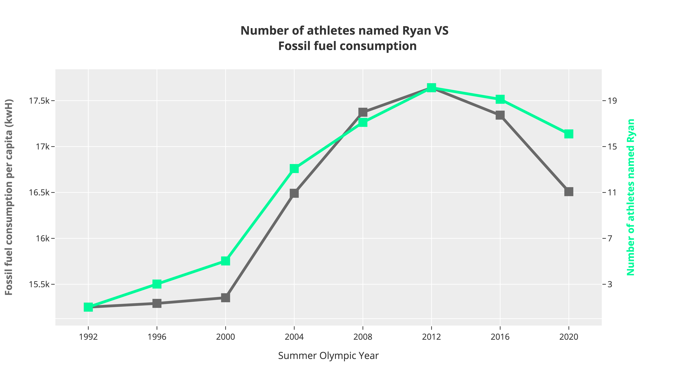
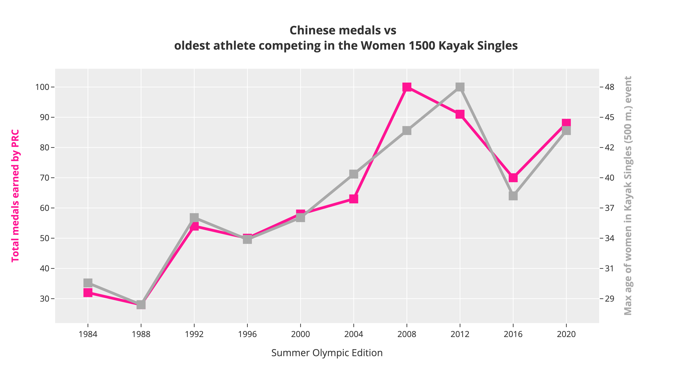
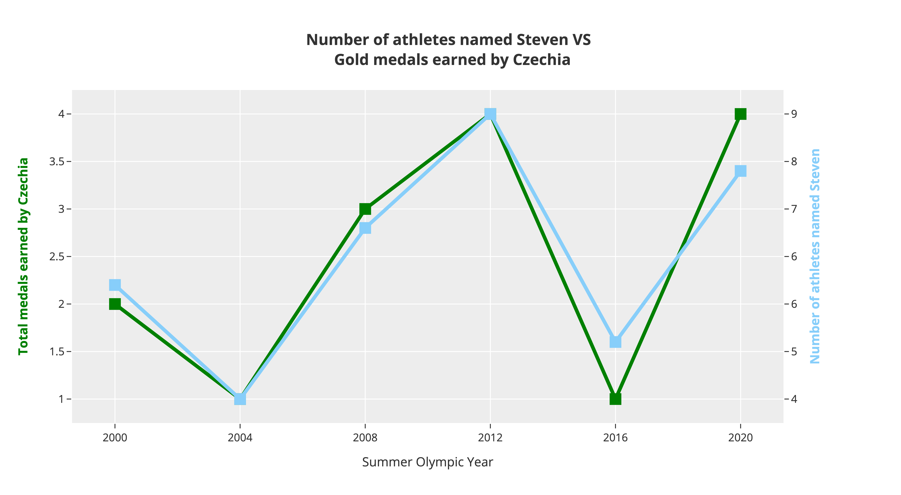
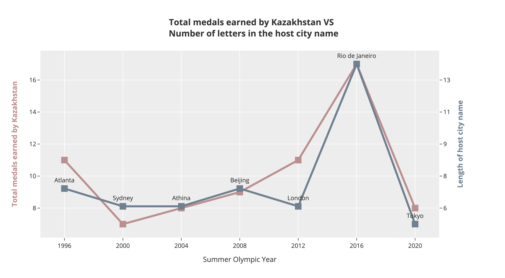
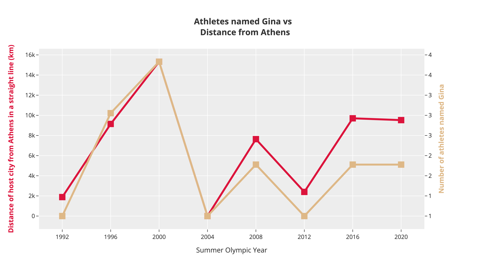

# The cOrrelympics
A project by Olivier Simard-Hanley & Jessica Black

This is a fun project assembled for the Deloitte 2024 Tableau visualization competition, which focused on the olympics. The task was to build an interesting visual story around data collected from all editions of the Olympic games.

Inspired by Tyler Vigen's [Spurious Correlations website](https://www.tylervigen.com/spurious-correlations), we set out to find startling and unsettling connections between different seemingly unrelated concepts. From multiple datasources, we built a aggregate dataset containing over 3000 variables describing different facets of each olympic game. We then calculated the correlation between all numerical columns in the file to find some interesting relationships. This dubious research technique is called data dredging and is usually frowned upon, since examining vast amounts of data is bound to yield at least a few patterns. We plotted the top correlated columns and selected those that were most graphically appealing.

All the data processing code is in [`analysis_gh_version.ipynb`](https://github.com/malcolmosh/correlympics/blob/main/analysis_gh_version.ipynb). Here are a few examples!

